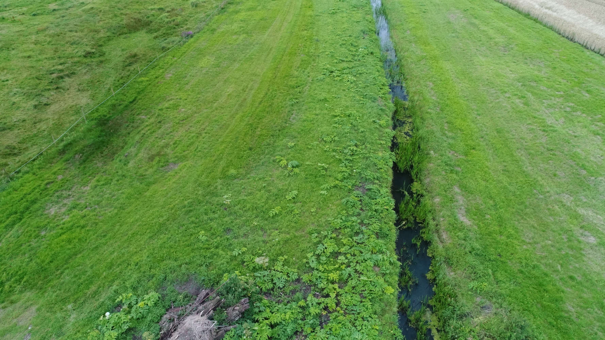
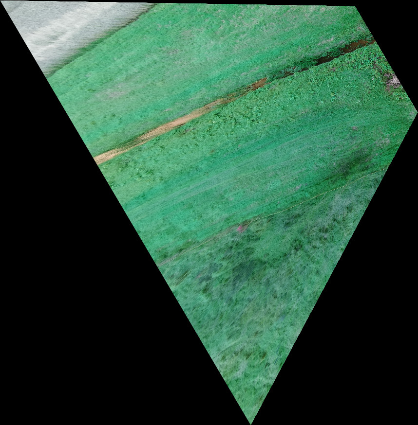

# Tutorial - Projecting your first image to the ground
This tutorial will describe how to use the project_image_to_map tool. 

In this tutorial we will look at how to project the image **DJI_0027.JPG** down on a planar model of the Earths surface and store the output as a georeferenced tiff file with the name **dji_0027_on_map.tif**.

The input image **DJI_0027.JPG** was acquired by a DJI Phantom 4 Pro drone and looks as follows.


And the generated georeferenced image looks like this.


To project the input image on the ground plane the following command is used.
```bash
pipenv run python project_image_to_map.py DJI_0027.JPG dji_0027_on_map.tif --gsd=0.1 --focallength=3666
```

From the **.JPG** file the program reads information about the camera orientation and its height above the ground. In addition the program needs information about the focallength of the camera. This is sometimes present in the **.JPG** file, but not always. Finally the desired *ground sample distance* (GSD) is specified in meters.